# RaceDocV1 Database ERD Draft

Status: Draft for Systems Architect approval before Supabase SQL schema generation.

Personas: Senior-backend, Senior-architect.

Phase: Database First.

```mermaid
erDiagram
  auth_users {
    uuid id PK
    string email
    timestamptz created_at
  }

  profiles {
    uuid id PK
    uuid auth_user_id FK
    string first_name_th
    string last_name_th
    string first_name_en
    string last_name_en
    string phone
    string identity_no
    string passport_no
    date date_of_birth
    string blood_type
    string nationality
    string address
    string postcode
    string line_id
    string facebook
    string instagram
    string youtube
    string tiktok
    string onboarding_status
    timestamptz created_at
    timestamptz updated_at
  }

  competitor_vehicles {
    uuid id PK
    uuid profile_id FK
    string manufacturer
    string model
    string color
    int year
    numeric engine_size_cc
    string engine_code
    string transmission
    string drivetrain
    string gearshift_pattern
    boolean is_active
    timestamptz created_at
  }

  competitor_licenses {
    uuid id PK
    uuid profile_id FK
    string license_no
    string categorization_grade
    string issued_by
    date date_of_issued
    date expiry_date
    timestamptz created_at
  }

  roles {
    uuid id PK
    string code UK
    string name
    string description
  }

  user_roles {
    uuid id PK
    uuid profile_id FK
    uuid role_id FK
    uuid season_id FK "nullable for Global Roles"
    boolean is_active
    uuid invited_by_id FK
    timestamptz created_at
  }

  role_invitations {
    uuid id PK
    uuid invited_profile_id FK
    uuid invited_by_id FK
    uuid role_id FK
    string email
    string status
    timestamptz expires_at
    timestamptz created_at
  }

  organizations {
    uuid id PK
    string name
    string slug
    jsonb brand_settings
    boolean is_active
  }

  teams {
    uuid id PK
    uuid organization_id FK
    uuid owner_profile_id FK
    string team_name
    string manager_name
    string manager_phone
    string address
    string postcode
    timestamptz created_at
  }

  team_memberships {
    uuid id PK
    uuid team_id FK
    uuid season_id FK
    uuid competitor_profile_id FK
    string status
    timestamptz accepted_at
    timestamptz revoked_at
    uuid created_by_id FK
  }

  team_invitations {
    uuid id PK
    uuid team_id FK
    uuid season_id FK
    uuid competitor_profile_id FK
    string invite_direction
    string status
    timestamptz expires_at
    timestamptz created_at
  }

  seasons {
    uuid id PK
    uuid organization_id FK
    string name
    int year
    string status
    boolean is_active
    timestamptz activated_at
    uuid created_by_id FK
  }

  circuits {
    uuid id PK
    string name
    string location
    string country
  }

  events {
    uuid id PK
    uuid season_id FK
    uuid circuit_id FK
    string name
    int event_order
    date starts_on
    date ends_on
    string status
  }

  races {
    uuid id PK
    uuid event_id FK
    string name
    int race_order
    string session_type
    timestamptz scheduled_at
    boolean results_import_unlocked
  }

  series_races {
    uuid id PK
    uuid organization_id FK
    string code
    string name
    string ballast_type
    boolean is_active
  }

  grades {
    uuid id PK
    string code
    string name
    int sort_order
  }

  season_series {
    uuid id PK
    uuid season_id FK
    uuid series_race_id FK
    boolean is_active
  }

  season_series_grades {
    uuid id PK
    uuid season_series_id FK
    uuid grade_id FK
    boolean is_active
  }

  event_series_rules {
    uuid id PK
    uuid event_id FK
    uuid series_race_id FK
    uuid grade_id FK
    string status
    int version
    boolean is_locked
    uuid cloned_from_id FK
    timestamptz locked_at
  }

  checklist_topics {
    uuid id PK
    uuid event_id FK
    string title_th
    string title_en
    int sort_order
    boolean is_required
    boolean is_active
  }

  checklist_items {
    uuid id PK
    uuid entry_form_id FK
    uuid checklist_topic_id FK
    boolean is_checked
    uuid updated_by_id FK
    timestamptz updated_at
  }

  inspection_form_templates {
    uuid id PK
    uuid event_series_rule_id FK
    string name
    int version
    boolean is_active
  }

  inspection_template_sections {
    uuid id PK
    uuid template_id FK
    string code
    string title
    int sort_order
    boolean is_fixed
  }

  inspection_template_items {
    uuid id PK
    uuid section_id FK
    string label_th
    string label_en
    string input_type
    jsonb options
    string weight_effect_type
    numeric fixed_weight_kg
    boolean is_required
    int sort_order
  }

  ballast_rules {
    uuid id PK
    uuid event_series_rule_id FK
    string ballast_type
    numeric max_ballast_kg
    boolean join_weight_enabled
    jsonb position_matrix
    jsonb removal_rule
  }

  point_rules {
    uuid id PK
    uuid event_series_rule_id FK
    jsonb position_points
    jsonb bonus_points
  }

  tire_rules {
    uuid id PK
    uuid event_series_rule_id FK
    string tire_brand
    string tire_model
    boolean is_allowed
  }

  sponsor_sticker_assets {
    uuid id PK
    uuid event_series_rule_id FK
    uuid file_asset_id FK
    string title
  }

  print_background_assets {
    uuid id PK
    uuid event_id FK
    uuid file_asset_id FK
    string title
    boolean is_default
  }

  entry_form_batches {
    uuid id PK
    uuid competitor_profile_id FK
    uuid submitted_by_id FK
    uuid team_id FK
    string status
    timestamptz created_at
  }

  entry_forms {
    uuid id PK
    uuid batch_id FK
    uuid season_id FK
    uuid event_id FK
    uuid series_race_id FK
    uuid grade_id FK
    uuid competitor_profile_id FK
    uuid team_id FK
    uuid vehicle_id FK
    uuid event_series_rule_id FK
    string car_number
    string status
    string payment_status
    boolean is_locked
    boolean is_eligible_to_race
    jsonb personal_snapshot
    jsonb driver_license_snapshot
    jsonb vehicle_snapshot
    jsonb team_snapshot
    text signature_path
    uuid approved_by_id FK
    timestamptz approved_at
    uuid created_by_id FK
    uuid updated_by_id FK
    timestamptz created_at
    timestamptz updated_at
    timestamptz deleted_at
    uuid deleted_by_id FK
  }

  entry_form_documents {
    uuid id PK
    uuid entry_form_id FK
    uuid file_asset_id FK
    string document_type
    boolean is_required
    timestamptz uploaded_at
  }

  inspection_forms {
    uuid id PK
    uuid entry_form_id FK
    uuid template_id FK
    string status
    numeric official_bop_weight_kg
    int current_version_no
    boolean is_locked
    uuid created_by_id FK
    uuid updated_by_id FK
    timestamptz submitted_at
  }

  inspection_form_versions {
    uuid id PK
    uuid inspection_form_id FK
    int version_no
    jsonb answers_snapshot
    numeric bop_base_weight_kg
    numeric bop_option_weight_kg
    numeric bop_total_weight_kg
    string status
    uuid inspected_by_id FK
    timestamptz created_at
  }

  inspection_item_results {
    uuid id PK
    uuid inspection_version_id FK
    uuid template_item_id FK
    string result_status
    jsonb answer_value
    numeric applied_weight_kg
    text comment
  }

  component_seals {
    uuid id PK
    uuid inspection_form_id FK
    uuid vehicle_id FK
    string component_type
    string seal_number
    boolean offsite_inspected
    boolean is_active
    timestamptz voided_at
    uuid recorded_by_id FK
    timestamptz recorded_at
  }

  weigh_in_sessions {
    uuid id PK
    uuid race_id FK
    string session_type
    string status
    timestamptz opened_at
    timestamptz closed_at
  }

  weigh_in_logs {
    uuid id PK
    uuid weigh_in_session_id FK
    uuid entry_form_id FK
    uuid inspection_form_id FK
    numeric bop_base_weight_kg
    numeric bop_option_weight_kg
    numeric success_ballast_kg
    numeric penalty_weight_kg
    numeric join_weight_kg
    numeric target_weight_kg
    numeric actual_weight_kg
    string status
    uuid weighed_by_id FK
    timestamptz weighed_at
  }

  competitor_requests {
    uuid id PK
    uuid entry_form_id FK
    uuid race_id FK
    uuid requester_profile_id FK
    uuid submitted_by_id FK
    string queue_no
    string topic
    string status
    jsonb request_payload
    numeric fine_amount
    string payment_status
    uuid payment_receipt_id FK
    numeric penalty_weight_kg
    string grid_penalty
    uuid final_decision_by_id FK
    timestamptz final_decision_at
    text final_comment
    timestamptz racer_consented_at
    string racer_consent_status
    timestamptz deleted_at
    uuid deleted_by_id FK
  }

  competitor_request_documents {
    uuid id PK
    uuid competitor_request_id FK
    uuid file_asset_id FK
    string document_type
  }

  request_approvals {
    uuid id PK
    uuid competitor_request_id FK
    uuid approver_profile_id FK
    string approver_role_code
    string status
    text comment
    timestamptz decided_at
  }

  race_results {
    uuid id PK
    uuid race_id FK
    uuid series_race_id FK
    uuid grade_id FK
    string status
    boolean is_official
    uuid imported_by_id FK
    uuid signed_off_by_id FK
    timestamptz signed_off_at
    text signature_path
    uuid scrutineer_report_id FK
  }

  race_result_entries {
    uuid id PK
    uuid race_result_id FK
    uuid entry_form_id FK
    int starting_position
    int position
    string result_code
    numeric points
    numeric success_ballast_delta_kg
    boolean pole_position
    boolean fastest_lap
  }

  ballast_ledger {
    uuid id PK
    uuid entry_form_id FK
    uuid race_id FK
    numeric ballast_kg
    string source_type
    uuid source_id
    boolean applies_to_next_race
    timestamptz created_at
  }

  championship_standings {
    uuid id PK
    uuid season_id FK
    uuid series_race_id FK
    uuid grade_id FK
    uuid competitor_profile_id FK
    uuid team_id FK
    int total_points
    int p1_count
    int p2_count
    int p3_count
    int rank
    numeric current_ballast_kg
    timestamptz calculated_at
  }

  scrutineer_reports {
    uuid id PK
    uuid race_id FK
    uuid series_race_id FK
    uuid grade_id FK
    string status
    jsonb report_snapshot
    text remarks
    uuid signed_by_id FK
    timestamptz signed_at
    text signature_path
    uuid print_background_id FK
    timestamptz deleted_at
    uuid deleted_by_id FK
  }

  notifications {
    uuid id PK
    uuid recipient_profile_id FK
    string channel
    string title
    text body
    string link_entity_type
    uuid link_entity_id
    boolean is_read
    timestamptz created_at
  }

  audit_logs {
    uuid id PK
    string entity_type
    uuid entity_id
    string action
    jsonb old_values
    jsonb new_values
    string previous_status
    string new_status
    uuid action_by_id FK
    timestamptz created_at
  }

  file_assets {
    uuid id PK
    string bucket
    string path
    string filename
    string mime_type
    bigint size_bytes
    uuid uploaded_by_id FK
    timestamptz deleted_at
    uuid deleted_by_id FK
    timestamptz created_at
  }

  auth_users ||--|| profiles : authenticates
  profiles ||--o{ user_roles : has
  roles ||--o{ user_roles : assigned_as
  seasons ||--o{ user_roles : scoped_to
  profiles ||--o{ role_invitations : invited_user
  profiles ||--o{ role_invitations : invited_by
  roles ||--o{ role_invitations : invites_role
  profiles ||--o{ competitor_vehicles : owns_vehicle
  profiles ||--o{ competitor_licenses : owns_license

  organizations ||--o{ seasons : owns
  organizations ||--o{ teams : owns
  organizations ||--o{ series_races : defines
  profiles ||--o{ teams : owns_team
  teams ||--o{ team_memberships : has
  profiles ||--o{ team_memberships : competitor
  profiles ||--o{ team_memberships : manager
  teams ||--o{ team_invitations : creates
  profiles ||--o{ team_invitations : competitor_or_manager

  seasons ||--o{ events : contains
  circuits ||--o{ events : hosts
  events ||--o{ races : contains
  seasons ||--o{ season_series : includes
  series_races ||--o{ season_series : scheduled_in
  season_series ||--o{ season_series_grades : has
  grades ||--o{ season_series_grades : available_as

  events ||--o{ event_series_rules : configures
  series_races ||--o{ event_series_rules : governed_by
  grades ||--o{ event_series_rules : scoped_to
  event_series_rules ||--o{ inspection_form_templates : defines
  inspection_form_templates ||--o{ inspection_template_sections : has
  inspection_template_sections ||--o{ inspection_template_items : has
  event_series_rules ||--o{ ballast_rules : defines
  event_series_rules ||--o{ point_rules : defines
  event_series_rules ||--o{ tire_rules : defines
  event_series_rules ||--o{ sponsor_sticker_assets : has
  events ||--o{ print_background_assets : has
  file_assets ||--o{ sponsor_sticker_assets : stores
  file_assets ||--o{ print_background_assets : stores

  profiles ||--o{ entry_form_batches : competitor
  profiles ||--o{ entry_form_batches : submitted_by
  teams ||--o{ entry_form_batches : team_context
  entry_form_batches ||--o{ entry_forms : spawns
  seasons ||--o{ entry_forms : season
  events ||--o{ entry_forms : event
  series_races ||--o{ entry_forms : series
  grades ||--o{ entry_forms : grade
  profiles ||--o{ entry_forms : competitor
  teams ||--o{ entry_forms : team
  competitor_vehicles ||--o{ entry_forms : used_in
  event_series_rules ||--o{ entry_forms : rule_snapshot
  entry_forms ||--o{ entry_form_documents : has
  file_assets ||--o{ entry_form_documents : stores

  events ||--o{ checklist_topics : defines
  entry_forms ||--o{ checklist_items : checked_for
  checklist_topics ||--o{ checklist_items : item
  profiles ||--o{ checklist_items : updated_by

  entry_forms ||--o| inspection_forms : has_one_per_event
  inspection_form_templates ||--o{ inspection_forms : uses
  inspection_forms ||--o{ inspection_form_versions : versions
  inspection_form_versions ||--o{ inspection_item_results : records
  inspection_template_items ||--o{ inspection_item_results : answered_item
  inspection_forms ||--o{ component_seals : has
  profiles ||--o{ inspection_form_versions : inspected_by
  profiles ||--o{ component_seals : recorded_by

  races ||--o{ weigh_in_sessions : has
  weigh_in_sessions ||--o{ weigh_in_logs : records
  entry_forms ||--o{ weigh_in_logs : weighed_car
  inspection_forms ||--o{ weigh_in_logs : bop_source
  profiles ||--o{ weigh_in_logs : weighed_by

  entry_forms ||--o{ competitor_requests : requests
  races ||--o{ competitor_requests : may_apply_to
  profiles ||--o{ competitor_requests : requester
  profiles ||--o{ competitor_requests : submitted_by
  competitor_requests ||--o{ competitor_request_documents : has
  file_assets ||--o{ competitor_request_documents : stores
  competitor_requests ||--o{ ballast_ledger : generates_penalty
  competitor_requests ||--o{ request_approvals : routed_to
  profiles ||--o{ request_approvals : approver

  races ||--o{ race_results : result_for
  series_races ||--o{ race_results : series
  grades ||--o{ race_results : grade
  scrutineer_reports ||--o| race_results : unlocks_or_supports
  race_results ||--o{ race_result_entries : contains
  entry_forms ||--o{ race_result_entries : result_entry
  race_result_entries ||--o{ ballast_ledger : produces
  entry_forms ||--o{ ballast_ledger : assigned_to
  races ||--o{ ballast_ledger : applies_after

  seasons ||--o{ championship_standings : has
  series_races ||--o{ championship_standings : series
  grades ||--o{ championship_standings : grade
  entry_forms ||--o{ championship_standings : standing_for

  races ||--o{ scrutineer_reports : report_for
  series_races ||--o{ scrutineer_reports : series
  grades ||--o{ scrutineer_reports : grade
  profiles ||--o{ scrutineer_reports : signed_by
  print_background_assets ||--o{ scrutineer_reports : printed_with

  profiles ||--o{ notifications : receives
  profiles ||--o{ audit_logs : action_by
  profiles ||--o{ entry_forms : deleted_by
  profiles ||--o{ competitor_requests : deleted_by
  profiles ||--o{ scrutineer_reports : deleted_by
  profiles ||--o{ file_assets : uploaded_by
  profiles ||--o{ file_assets : deleted_by
```

## Architecture Notes

- `profiles` wraps Supabase `auth.users`.
- `user_roles` is many-to-many and season-scoped, so Admin can safely invite and manage roles.
- `entry_form_batches` supports the multi-event submit flow that spawns one `entry_forms` row per selected Event.
- `event_series_rules` is the rule snapshot anchor for dynamic inspection forms, ballast, points, tires, stickers, and print backgrounds.
- `inspection_forms` has versioning so old Event schemas and historical answers remain valid.
- `weigh_in_logs` stores the full calculated weight breakdown, not only actual weight.
- `race_result_entries` feeds `ballast_ledger`, which feeds future Weight-in target calculations.
- `race_result_entries` also feeds the cached `championship_standings.p1_count`, `championship_standings.p2_count`, and `championship_standings.p3_count` values through a PostgreSQL trigger. The frontend MUST NOT calculate or submit these cache fields.
- `competitor_requests` can create penalty weight, fines, grid penalties, and route approvals to selected committee members.
- `scrutineer_reports` interlock with `race_results` before results can become official.
- `audit_logs`, `notifications`, and `file_assets` are system-wide support tables.
- `inspection_forms.status` is the source of truth for `entry_forms.is_eligible_to_race`. A PostgreSQL trigger MUST set eligibility to `true` only when inspection status is `Passed`; every other inspection status forces eligibility to `false`.
- Soft deletes (`deleted_at`) are implemented on core tables and `file_assets` for restoration/visibility control. Storage Garbage Collection is intentionally deferred for V1.
- **Constraints & Nullability (MUST IMPLEMENT IN SQL):**
  - `entry_forms.team_id`, `entry_forms.vehicle_id`, and `entry_forms.approved_by_id` MUST be NULLABLE to support saving Drafts.
  - MUST implement a Partial UNIQUE INDEX on `entry_forms (competitor_profile_id, event_id) WHERE status = 'Active'` to prevent multiple active forms per event.

## Implementation Warnings & Trade-offs (For Dev Team)
- **Garage Syncing:** Do NOT rely solely on `vehicle_id` for historical data. The frontend MUST capture the Garage data and freeze it into `vehicle_snapshot` at the time of submission. This prevents historical forms from changing if the competitor edits their Garage vehicle mid-season.
- **Soft Delete Ghosting:** Every single Backend query/RPC MUST include `WHERE deleted_at IS NULL`. We will enforce this globally using Supabase Row Level Security (RLS) to prevent human error.
- **Database-Owned Cache Fields:** `p1_count`, `p2_count`, `p3_count`, and `is_eligible_to_race` MUST be maintained by PostgreSQL triggers only. React/Frontend must never submit these values directly, otherwise championship ranking and race eligibility can become unsafe.
- **Racer Consent Override:** To prevent race-day delays if a racer is unreachable, the system must allow an Admin/Secretary to override the `racer_consent_status`. This action MUST be strictly logged in `audit_logs` with a mandatory `reason`.
- **Hybrid Payment System:** Database tracks `payment_status` at the individual `entry_forms` level. For "Batch Payments", the frontend UI will duplicate the `file_asset_id` (slip) across the grouped forms, and provide a "Bulk Approve" button for the Secretary.
- **Multiple Active Events:** The database intentionally allows multiple events to have an 'Active' status simultaneously (to support overlapping Open Registration and Live events). The Frontend MUST use a UI Dropdown context selector to let users choose which Event they are currently interacting with, rather than relying on a global "Active Event" database lock.
- **Storage Garbage Collection Deferred:** V1 will not physically delete orphaned Storage objects. `file_assets.deleted_at` only hides files from users. A separate cleanup script can be introduced after production behavior is stable.
